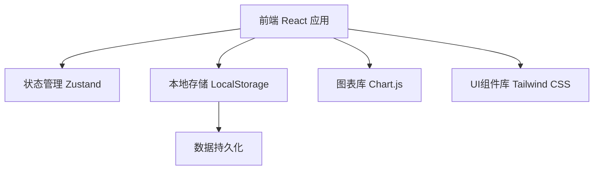
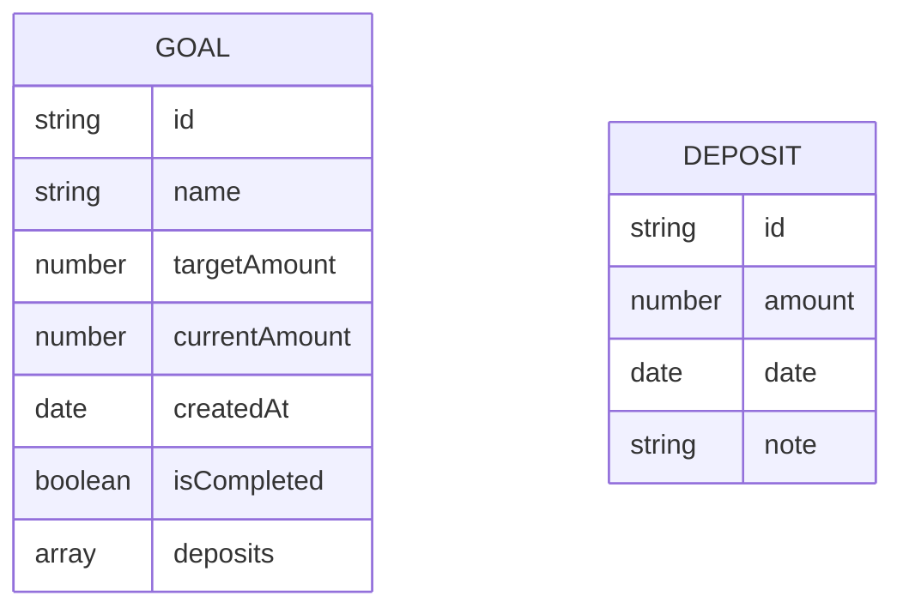

## 1. 架构设计


## 2. 技术描述
- **前端**：React@18 + TypeScript + Tailwind CSS + Vite
- **初始化工具**：vite-init
- **状态管理**：Zustand
- **图表库**：Chart.js + react-chartjs-2
- **存储**：LocalStorage（本地数据持久化）
- **安卓打包**：Capacitor

## 3. 路由定义
| 路由 | 用途 |
|------|------|
| / | 首页 - 目标列表和全局统计 |
| /goal/:id | 目标详情页 |
| /settings | 设置页 |

## 4. 数据模型
### 4.1 数据模型定义


### 4.2 数据结构定义
```typescript
interface Deposit {
  id: string;
  amount: number;
  date: string;
  note?: string;
}

interface Goal {
  id: string;
  name: string;
  targetAmount: number;
  currentAmount: number;
  createdAt: string;
  isCompleted: boolean;
  deposits: Deposit[];
}

interface AppState {
  goals: Goal[];
  theme: string;
  addGoal: (goal: Omit&lt;Goal, 'id' | 'currentAmount' | 'isCompleted' | 'deposits' | 'createdAt'&gt;) =&gt; void;
  deleteGoal: (id: string) =&gt; void;
  addDeposit: (goalId: string, deposit: Omit&lt;Deposit, 'id'&gt;) =&gt; void;
  deleteDeposit: (goalId: string, depositId: string) =&gt; void;
  setTheme: (theme: string) =&gt; void;
}
```

## 5. 主题配置
支持以下主题：
- 默认橙（活力橙）
- 薄荷绿
- 天空蓝
- 浪漫紫
- 深邃黑

## 6. 文件结构
```
/workspace
├── src/
│   ├── components/
│   │   ├── GoalCard.tsx
│   │   ├── ProgressBar.tsx
│   │   ├── DepositModal.tsx
│   │   ├── CalendarView.tsx
│   │   ├── MonthlyChart.tsx
│   │   └── ThemeSwitcher.tsx
│   ├── pages/
│   │   ├── Home.tsx
│   │   ├── GoalDetail.tsx
│   │   └── Settings.tsx
│   ├── hooks/
│   │   └── useStore.ts
│   ├── utils/
│   │   └── formatters.ts
│   ├── App.tsx
│   └── main.tsx
├── public/
├── capacitor.config.ts
├── vite.config.ts
├── tailwind.config.js
└── package.json
```
