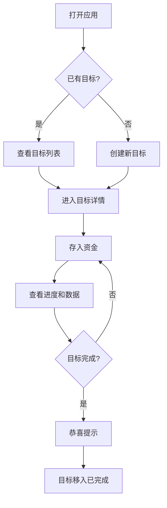

## 1. 产品概述
"就要买它"是一款帮用户实现攒钱目标的移动应用，通过直观的界面和丰富的数据可视化，让存钱变得有趣且有成就感。
- 帮助用户制定并追踪多个攒钱目标，记录每一笔存款，清晰展示进度
- 通过数据统计和图表分析，让用户了解自己的存钱习惯，实现财务目标

## 2. 核心功能

### 2.1 用户角色
| 角色 | 注册方式 | 核心权限 |
|------|----------|----------|
| 普通用户 | 无需注册 | 全部功能使用权限 |

### 2.2 功能模块
1. **首页**：目标列表展示、全局统计、新建目标入口
2. **目标详情页**：进度展示、存款记录、签到日历、月度图表
3. **设置页**：主题切换、数据管理

### 2.3 页面详情
| 页面名称 | 模块名称 | 功能描述 |
|----------|----------|----------|
| 首页 | 目标列表 | 展示进行中和已完成的目标，支持新建、编辑、删除目标 |
| 首页 | 全局统计 | 显示总存款、目标完成率等关键数据 |
| 目标详情页 | 进度可视化 | 进度条、百分比、已存/剩余金额展示 |
| 目标详情页 | 存款记录 | 流水明细、新增存款、删除记录 |
| 目标详情页 | 签到日历 | 日历形态展示每日存款记录 |
| 目标详情页 | 月度图表 | 柱状图展示每月存钱走势 |
| 设置页 | 主题切换 | 多种UI主题供用户选择 |

## 3. 核心流程
用户打开应用 → 查看已有目标或创建新目标 → 点击目标进入详情 → 存入资金 → 查看进度、日历和图表 → 目标完成收到恭喜提示

## 4. 用户界面设计
### 4.1 设计风格
- **主色调**：活力橙（#FF6B35）、薄荷绿（#00C49A）、天空蓝（#4A90E2）
- **按钮风格**：圆角卡片式，有按压反馈
- **字体**：Noto Sans SC，清晰易读
- **布局风格**：卡片式布局，层次分明
- **图标风格**：线条简洁的SVG图标

### 4.2 页面设计概述
| 页面名称 | 模块名称 | UI元素 |
|----------|----------|--------|
| 首页 | 目标列表 | 渐变色卡片、进度条、悬停动画 |
| 首页 | 全局统计 | 数据看板、大数字展示 |
| 目标详情页 | 进度可视化 | 大进度条、环形进度、动画效果 |
| 目标详情页 | 签到日历 | 日历网格、每日存款标记 |
| 目标详情页 | 月度图表 | 彩色柱状图、交互提示 |
| 设置页 | 主题切换 | 主题预览卡片、一键切换 |

### 4.3 响应式
移动优先设计，完美适配各种屏幕尺寸，触摸交互优化。

### 4.4 动画效果
- 页面加载时的元素渐入动画
- 存款成功的庆祝动画
- 进度条更新的平滑过渡
- 目标完成的礼花效果
